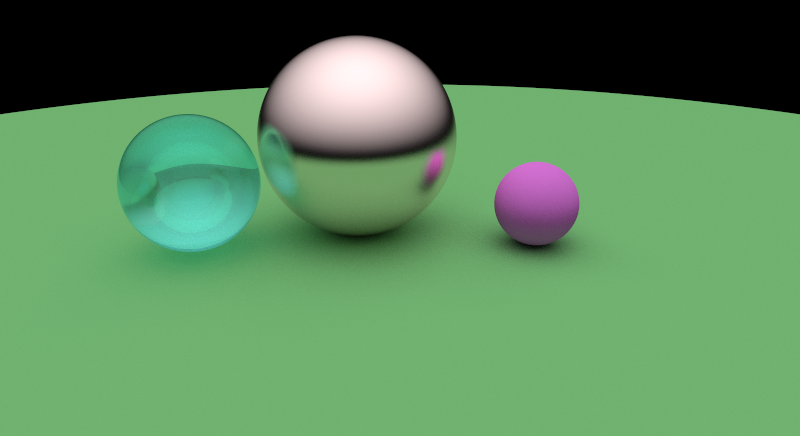

# Ray tracing

This is a basic ray tracer built in a weekend, following the "Ray tracing in one weekend" [book](https://raytracing.github.io/). The ray tracer supports the following:

Shapes:
- triangles
- spheres
- Soon: meshes

Materials:
- diffuse
- reflective (and partially reflective)
- emitting
- refractive

Camera configuration:
- position
- orientation
- field of view
- focal point

